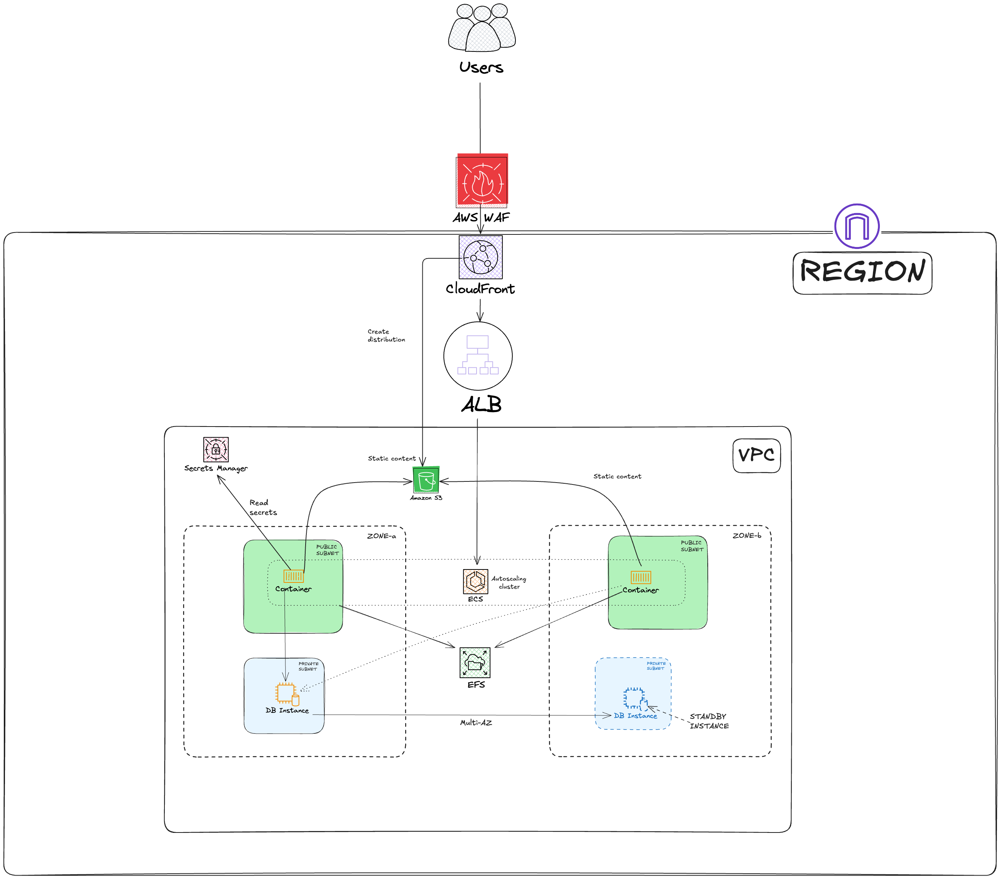

# AWS WordPress Infrastructure with Terraform

## Introduction
This project provides Infrastructure as Code (IaC) for deploying a highly available, scalable WordPress installation on AWS using Terraform. It implements AWS best practices for running production-grade WordPress websites with containerized architecture.

### Key Benefits
- **High Availability**: Multi-AZ deployment with automatic failover
- **Scalability**: ECS Fargate for automatic container scaling
- **Security**: Private subnets, security groups, and SSL/TLS support
- **Performance**: Application Load Balancer and RDS optimized configuration
- **Reliability**: EFS for persistent storage and RDS for managed database

## Architecture Overview



Key Components:
- VPC with public and private subnets across multiple AZs
- ECS Fargate for container orchestration
- RDS MySQL database in Multi-AZ configuration
- EFS for WordPress media storage
- Application Load Balancer with SSL/TLS termination
- Security Groups for network access control

Please note that this is the target desired architecture but some components in the diagram are still to be configured:

- Cloudfront CDN is just in a branch until a real domain will be available.
- Wordpress can be configured to push pull static content from storage buckets to better improve performance and save some costs.
- Web application firewall WAF is on a branch and needs to be tested.

## Prerequisites
- AWS Account with administrative access.
- Terraform (version >= 1.10)
- AWS CLI configured with appropriate credentials
- S3 storage bucket for terraform state

## Deployment Instructions

1. Clone the repository and setup AWS credentials:
```bash
git clone <repository-url>
```

When you're in the terraform root module, run this to setup a bucket for terraform

Create and select your AWS profile

```shell
aws configure --profile terraform-worpress
```

Change the variable AWS_PROFILE in the script below and run it.

```shell
export AWS_PROFILE=${MY_AWS_PROFILE_NAME} 
export AWS_REGION=eu-south-1 # Choose another region if needed

BUCKET_NAME=terraform-wordpress-state-$(openssl rand -hex 2)

aws s3api create-bucket \
--bucket terraform-wordpress-state-$(openssl rand -hex 2) \
--region ${AWS_REGION} \
--create-bucket-configuration LocationConstraint=${AWS_REGION}

cat << EOF > "env/backend_s3_personal.hcl"
bucket = "$BUCKET_NAME"
key    = "wordpress"
region = "$AWS_REGION"
EOF
```


2. Initialize Terraform:

WARNING: Be sure the s3 bucket for terraform state is created! Check the file content before running init!

```bash
terraform init -backend-config="env/backend_s3_personal.hcl"
```

3. Review the execution plan:
```bash
terraform plan
```

5. Apply the infrastructure:
```bash
terraform apply
```

Example of output:

```shell
wordpress_urls = {
  "alb_https" = "https://wordpress-alb-xxxxxxxxxx.eu-south-1.elb.amazonaws.com"
}
```

Access the application using the url in the output "alb_https". The first time the database must be configured.

Please note that the https certificate is self signed and left in the ssl dir intentionally to use https provisioning 
for the sake of simplicity. A real domain is not available so we are using the amazon domain for which we cannot 
generate a certificate because we don't own that domain.


## Deployment

The deployment is based on Github release and tag. Every time a new release is created with the associate tag, a deploy
will be done using the same terraform code by passing the version tag as the docker image version of the wordpress container..

Go to [Github release page](https://github.com/ltozi/aws-wordpress/releases) Github release page to start a new release 
and deploy a new version.

Update the credentials to trigger a deploy **AWS_ACCESS_KEY_ID** and **AWS_ACCESS_KEY** in the dev environment 
inside the repo.

Also, set up TF_STATE_BUCKET in plain text as var in the same environment.

